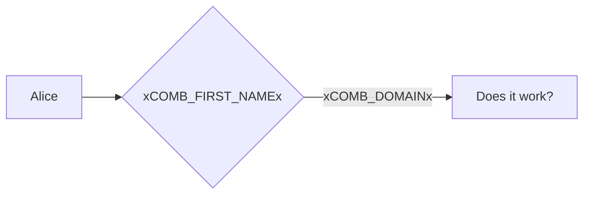
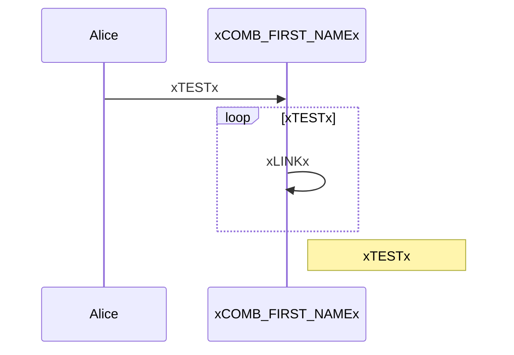

# Tests: Mermaid diagrams

These diagrams require the Material theme to work correctly.

!!! fail "Known issue"
    Placeholders in mermaid diagrams do not get replaced (yet). I will try to fix it in the furure

Flowchart:

Sequence diagram:

@TODO: As soon as the two above work, create simple diagrams for all officially supported types
