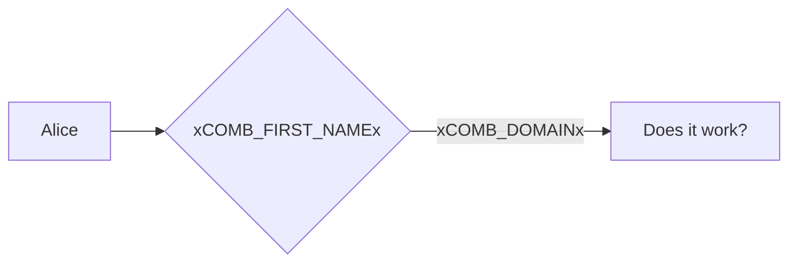
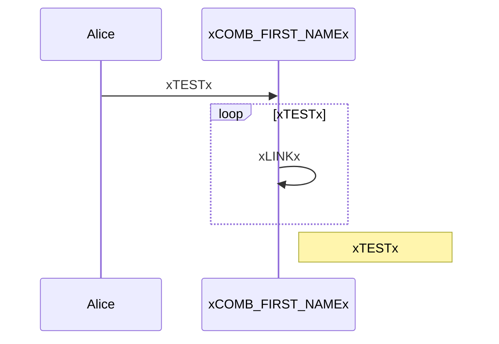

# Tests: Mermaid diagrams

These diagrams require the Material theme to work correctly.

!!! warning "May be unreliable"
    As far as I could figure out, there is no way to change a MermainJS diagram after it was rendered.
    So my workaround is replacing the page contents before MermaidJS reads it.
    You can do this with the following config option:

    ```yaml
    plugins:
    - placeholder:
        replace_delay_millis: -1
    ```

    This may not always work or may cause other issues.

## Flowchart

Code:
```
graph LR
  A[Alice] --> B{xCOMB_FIRST_NAMEx};
  B -->|xCOMB_DOMAINx| C[Does it work?];
```

Rendered:


## Sequence diagram

Code:
```
sequenceDiagram
  Alice->>xCOMB_FIRST_NAMEx: xTESTx
  loop xTESTx
      xCOMB_FIRST_NAMEx->>xCOMB_FIRST_NAMEx: xLINKx
  end
  Note right of xCOMB_FIRST_NAMEx: xTESTx
```

Rendered:



@TODO: Create simple diagrams for all officially supported types
