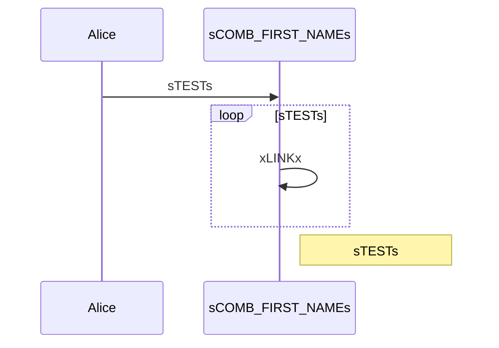

# Tests: Mermaid diagrams


These diagrams require the Material theme to work correctly.

!!! warning "May be unreliable"
    As far as I could figure out, there is no way to change a MermainJS diagram after it was rendered.
    So my workaround is replacing the page contents before MermaidJS reads it.
    You can do this with the following config option:

    ```yaml title="placeholder-plugin.yaml"
    settings:
      replace_delay_millis: -1
    ```

    This may not always work or may cause other issues.

    In the page use static placeholder replacement for all placeholders in the diagrams.
    This will cause the site to be relaoded, when one of the values changes, which is required to update the Mermaid diagrams.

## Placeholder values

You can enter your values here and reload the page:

## Flowchart

Code:
```
graph LR
  A[Alice] --> B{xCOMB_FIRST_NAMEx};
  B -->|sCOMB_DOMAINs| C[Does it work?];
```

Rendered:


## Sequence diagram

Code:
```
sequenceDiagram
  Alice->>sCOMB_FIRST_NAMEs: sTESTs
  loop sTESTs
      sCOMB_FIRST_NAMEs->>sCOMB_FIRST_NAMEs: xLINKx
  end
  Note right of sCOMB_FIRST_NAMEs: sTESTs
```

Rendered:

