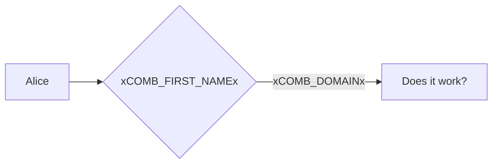

# Tests: Static replacements

The following inputs should be disabled:

Variable | Value
---|---
Undefined placeholder | <input data-input-for=static-undefined-placeholder>

## Outputs

When you inspect this page's source code, you should see the placeholder values (and not the placeholders themselves).

<placeholdertable entries="all" show-readonly="true" type="name, input, value">


## Mermaid diagram

Code:
```
graph LR
  A[Alice] --> B{xCOMB_FIRST_NAMEx};
  B -->|xCOMB_DOMAINx| C[Does it work?];
```

Rendered:


