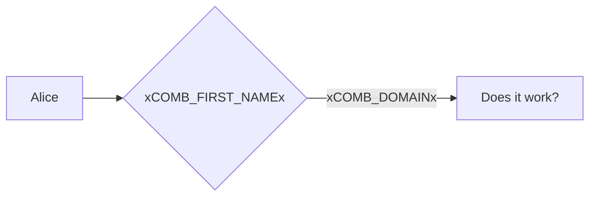

# Tests: Static replacements

The following inputs should be disabled:

Variable | Value
---|---
TEST | <input data-input-for="TEST">
LINK | <input data-input-for="LINK">
Undefined placeholder | <input data-input-for=static-undefined-placeholder>

## Outputs

When you inspect this page's source code, you should see the placeholder values (and not the placeholders themselves).

Variable | Value
---|---
TEST | xTESTx
LINK | xLINKx

## Mermaid diagram

Code:
```
graph LR
  A[Alice] --> B{xCOMB_FIRST_NAMEx};
  B -->|xCOMB_DOMAINx| C[Does it work?];
```

Rendered:


